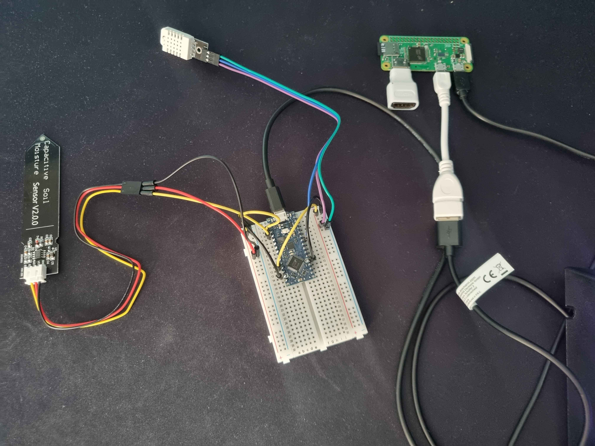

# My-Greenhouse
Mobile application which displays all the information about your greenhouse (temperature, feeled temperature, air humidity and soil humidity), and which sends you all other important information (weather, etc.).

## Summary
- [How To Install the Project](#how-to-install-the-project)
- [Languages and Technologies](#languages-and-technologies)
   - [Web application](#Web-application)
   - [Mobile application](#Mobile-application)
   - [Database](#database)
   - [Docker](#docker)
- [Run](#run)
- [License](#license)
- [Authors](#authors)

## Products
Here is the hardware i'm using for the project with the link where i'm buying it :
- [Mini breadboard](https://fr.aliexpress.com/item/32614008350.html?spm=a2g0o.productlist.0.0.5dd7wwSAwwSAc0&mp=1&gatewayAdapt=glo2fra#nav-specification)
- [Kit Pi Zero W](https://www.kubii.com/fr/kits-nano-ordinateurs/2077-kit-pi-zero-w-kubii-3272496009509.html)
- [Arduino Nano Every with headers](https://store.arduino.cc/en-fr/products/arduino-nano-every-with-headers)
- [DHT 22 sensor](https://fr.aliexpress.com/item/1005005545184001.html?spm=a2g0o.productlist.main.9.7d1dszNGszNGfj&algo_pvid=09bab774-abe0-45ee-97b6-eded12b93e16&utparam-url=scene%3Asearch%7Cquery_from%3A)
- [Soil humidity](https://fr.aliexpress.com/item/1005004634714711.html?spm=a2g0o.productlist.main.11.78ff7dc2bByJCn&algo_pvid=4061f8f3-bbaf-43a1-b214-98e3392f1209&utparam-url=scene%3Asearch%7Cquery_from%3A)
- [Usb Conn Cable Type a-Micro B](https://www.amazon.fr/gp/product/B0093LID6K/ref=ewc_pr_img_1?smid=A1X6FK5RDHNB96&psc=1)

Total price : ~ 63.5€ 

## How To Install the Project
Here is all the steps to follow which will make your My Greenhouse's box working well !

### 1. Hardware Installation
First, power on your Raspberry with the SD card inside, connect it in HDMI and in USB with a keyboard, configure it, connect it on the wifi and install the updates.

You can put a static ip to connect easily on SSH.
#### Raspberry Pi Config
1. go to your Desktop folder : 
```bash
 cd Desktop/ 
 ```
2. clone the github repo :
```bash
git clone https://github.com/Spykoninho/My-Greenhouse.git
```
3. put the env variables : follow the env-example file
```bash
sudo nano /etc/environment
source /etc/environment
```
4. exec the file configUsr.sh : (it's possible that it's not recognize the env variable API_IP_HOST at the beginning)
```bash
chmod +x ~/Desktop/My-Greenhouse/configUsr.sh
sudo ./configUsr.sh
```
   3. Follow the instructions

#### Arduino config
1. Install the arduino IDE on your computer
2. Link your arduino on your computer
3. On your IDE, select 'Arduino Nano Every'
4. Click YES on the popup.
5. Accept the download request
6. Go on the library manager and download the 'DHT sensor library' by Adafruit
7. Paste the code in [scriptDHT](/scriptDHT.ino)
8. Verify and upload the code.

#### Connect the Raspberry and the Arduino
1. Go on your Raspberry, install python3 : 
```bash
sudo apt-get install python3
sudo apt-get install python3-pip
pip install virtualenv
```
2. Create a virtual env
```bash
cd ~/Desktop
virtualenv virtualenv_name
source venvPython/bin/activate
```
3. Install dependancies :
```bash
python3 -m pip install requests
pip install pyserial
```
4. Connect the sensors to the arduino:
   1. DHT
      1. VCC to 5V
      2. GND to GND
      3. DATA to D6
   2. Humidity sensor
      1. VCC to 3.3V
      2. GND to GND
      3. DATA to A0
 
      Example : 


#### Print the 3d box
Go on website like [3denligne.fr](https://3denligne.fr/) and print the two models : 
- The [box](./mg_boite.stl)
- The [cover](./mg_couvercle.stl)

Then, put the breadboard, raspberry and sensors inside the box.

#### Start python file at the boot
create a service :
```bash
sudo nano /lib/systemd/system/mygreenhouse.service
```
put inside : 
```bash
[Unit]
Description=Send sensor data to db
After=network.target


[Service]
Type=idle
Restart=on-failure
User=root
ExecStart=/bin/bash -c 'cd /home/YOUR_USERNAME/Desktop/venvPython/ && source venvPython/bin/activate && cd /home/YOUR_USERNAME/Desktop/My-Greenhouse/ && python3 raspArduino.py'
Environment="JWT=YOUR_JWT"
Environment="GREENHOUSE_ID=YOUR_GREENHOUSE_ID"
Environment="API_IP_HOST=YOUR_API_IP_HOST"

[Install]
WantedBy=multi-user.target
```
then
```bash
sudo systemctl daemon-reload
sudo systemctl enable mygreenhouse.service
```
### 2. API / DB
I made the choice to store the data and api on a VPS but you can put it in your raspberry with a sqlite for example.

#### Docker
A docker-compose file is present at the root of the directory, containing 2 services: the api and the database. For the API, a Dockerfile is also present to provide the image for building the api.

Before starting containers, run : 
```bash
chmod +x install-build-projects.sh
./install-build-projects.sh
```
then, start the containers : 

```bash
docker compose up --build
```
The --build option is used to build the api service with its Dockerfile, you can remove it if you don't need it

Check that containers have been successfully booted

```bash
docker ps
```

The website should normally be accessible at `http://localhost:3000` and the api at `http://localhost:3001`
(Or the port you specified)

## Languages and Technologies

### Mobile application


### Database 


### Containerization


## License


This project is under MIT License with an additional clause to prevent commercial use.

See [the license](./.github/LICENSE)

## Authors

- <a href="https://github.com/Spykoninho">@SpyKo</a>

## For contributors
See [the contributors guide](./.github/CONTRIBUTING.md)

## Changelog
See [the changelog](./.github/CHANGELOG.md)
